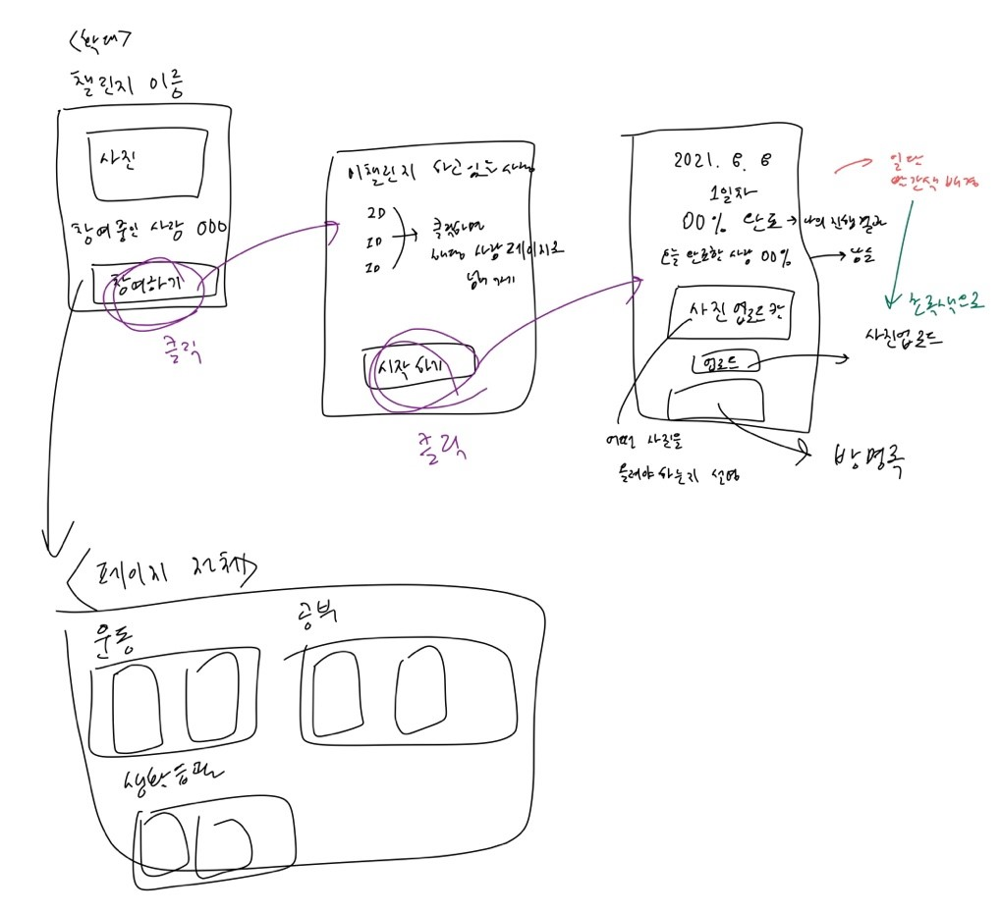

# 🍀To-do & Challenge Project
-------------------------
# 🧑‍🤝‍🧑조원
**21110070 류준규**  
**19101499 백송희**  
**17101472 심유준** 
------------------
----------------
# ❓프로젝트 주제 선정 이유
> not yet
>
---------------------
# 🏃: 진행과정

No|일시|주제|파일|
----|----|----|----|
1|08.04(수)|Idea 생각해서 적기|[idea.md](./background/idea.md)
2|08.08(일)|Idea 기능종합 & 진행방식정하기 |[1주차_정리](./background/1주차_최종정리.md)
3|08.11(수)|맡은 파트 코드 작성하기|
--------------

# 👏 진행방법
--------------
#### 1. 회의는 줌을 통해 진행.
#### 2. To-do파트와 Challenge파트를 나눠서 To-do에 1명, Chanllenge에 2명으로 나눠 서로 만들어야 하는 page를 분담하여 08.11(수)밤까지 만들어 git에 올리기로함.
#### 3. 회의 때 구현 못하거나 모르는부분 서로 얘기하고 파트 다시 섞어서 부족한 부분 채우기.
> 
> 대략적인 img는 밑에 올려둠.

To-do|Challenge
--|--
;|

# 📚k: 학습자료
* 강의
  * 동적웹페이지를위한웹프로그래밍
* 책
  * [yes24,자바스크립트프로젝트북](http://www.yes24.com/Product/Goods/44272668)

